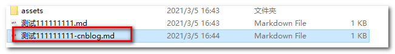

# cnblog-tool

## 介绍
cnblog-tool 是用node electron 开发的一个博客园发布博客的小工具

## 软件架构
使用node+electron+html+css+js

## cnblog-tool能干啥

- 解析md文件中的本地图片上传到博客园的图床
- 上传md文件内容到指定分类
- 将md中的文件图片全部转换成base64格式，不依赖任何图床

## 安装教程

### 下载

https://gitee.com/makalochen/cnblog-tool/blob/master/exe/makalo-cnblog-tool%20Setup%203.0.0.exe

### 安装

双击下载下来的exe安装程序

## 使用说明

初次使用，会让你登录，该账号是你博客园的用户名和密码，之所以要登录，是因为该工具基于博客园的`metaweblog`，登录成功会在你的安装目录下有个`cnblog-tool.json`的配置文件，里面保存了你的配置，如果需要重置直接删除此文件即可

### 初次使用

登录成功会写入配置

### 本地图片上传到博客园的图床

找md文件，选中后鼠标右击，如

上传完了会在同目录下生成一个已经替换好的文件，如

### 上传md文件内容到指定分类

选中生成好的文件，鼠标右击

选择分类，点击确认上传

上传完了后，会返回博客园的链接，可直接复制到浏览器查看

### markdwon中的图片转换成base64

右击md文件，选择转换

会生成一个新的文件

文件打开会发现，文件内容中的图片已经转换成base64格式了

## 参与贡献

1.  Fork 本仓库
2.  新建 Feat_xxx 分支
3.  提交代码
4.  新建 Pull Request
